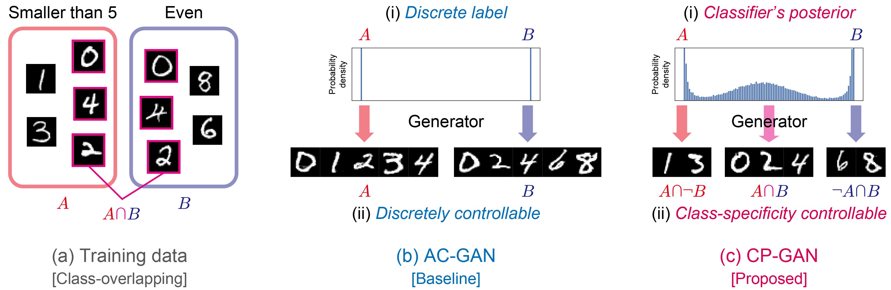
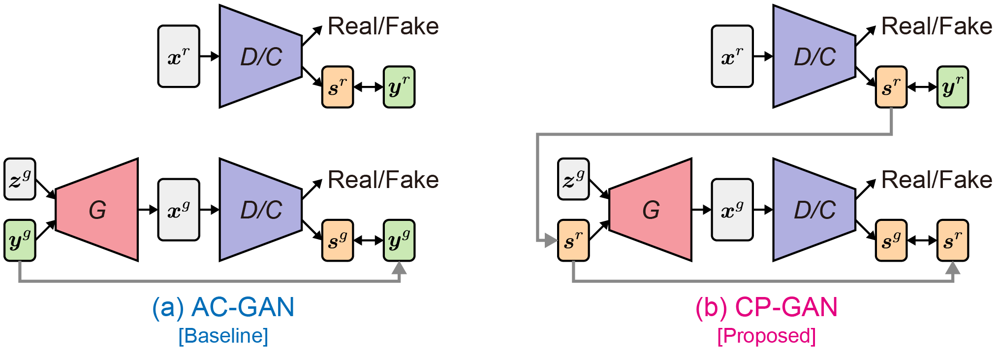
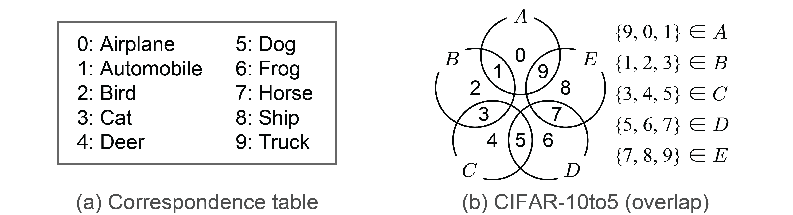

# CP-GAN: Class-Distinct and Class-Mutual Image Generation with GANs (BMVC 2019)

This repository provides PyTorch implementation for [**classifier's posterior GAN (CP-GAN)**](https://arxiv.org/abs/1811.11163). Given *class-overlapping* data, CP-GAN can learn *a class-distinct and class-mutual image generator* that can capture between-class relationships and generate an image selectively based on the *class specificity*.



**Note:**
In our other studies, we have also proposed GAN for *label noise* and GAN for *image noise*. Please check them from the links below.

- [**Label-noise robust GAN (rGAN)**](https://takuhirok.github.io/rGAN/) (CVPR 2019): GAN for *label noise*
- [**Noise robust GAN (NR-GAN)**](https://takuhirok.github.io/NR-GAN/) (CVPR 2020): GAN for *image noise*

## Paper

**Class-Distinct and Class-Mutual Image Generation with GANs**.<br>
[Takuhiro Kaneko](http://www.kecl.ntt.co.jp/people/kaneko.takuhiro/), [Yoshitaka Ushiku](https://yoshitakaushiku.net/), and [Tatsuya Harada](https://www.mi.t.u-tokyo.ac.jp/harada/).<br>
In BMVC 2019 (Spotlight).

[**[Paper]**](https://arxiv.org/abs/1811.11163)
[**[Project]**](https://takuhirok.github.io/CP-GAN/)
[**[Slides]**](docs/CP-GAN_slides.pdf)
[**[Poster]**](docs/CP-GAN_poster.pdf)

## Overview

Our goal is, given *class-overlapping* data, to construct a *class-distinct and class-mutual image generator* that can selectively generate an image conditioned on the *class specificity*. To solve this problem, we propose **CP-GAN** (b), in which we redesign the generator input and the objective function of auxiliary classifier GAN (AC-GAN) [2]&nbsp;(a). Precisely, we employ the classifier’s posterior to represent the between-class relationships and incorporate it into the generator input. Additionally, we optimize the generator so that the classifier’s posterior of generated data corresponds with that of real data. This formulation allows CP-GAN to capture the between-class relationships in a data-driven manner and to generate an image conditioned on the *class specificity*.



## Installation

Clone this repo:

```bash
git clone https://github.com/takuhirok/CP-GAN.git
cd CP-GAN/
```
First, install Python 3+. Then install [PyTorch](https://pytorch.org/) 1.0 and other dependencies by

```bash
pip install -r requirements.txt
```

## Train

To train a model, use the following script:

```bash
python train.py \
    --dataset [cifar10/cifar10to5/cifar7to3] \
    --trainer [acgan/cpgan] \
    --out output_directory_path
```

Please choose one of the options in the square brackets ([ ]).

### Example
To train **CP-GAN** on **CIFAR-10to5**, run the following:

```bash
python train.py \
    --dataset cifar10to5 \
    --trainer cpgan \
    --out outputs/cifar10to5/cpgan
```

## Test
To generate images, use the following script:

```bash
python test.py \
    --dataset [cifar10/cifar10to5/cifar7to3] \
    --g_path trained_model_path \
    --out output_directory_path
```

Please choose one of the options in the square brackets ([ ]).

### Example
To test the above-trained model on **CIFAR-10to5**, run the following:

```bash
python test.py \
    --dataset cifar10to5 \
    --g_path outputs/cifar10to5/cpgan/netG_iter_100000.pth \
    --out samples
```

## Examples of generated images
### CIFAR-10to5
**Class-overlapping setting.**
The original **ten** classes (0,...,9; defined in (a)) are divided into **five** classes (*A*,...,*E*) with class overlapping, as shown in (b).



**Results.**
Each column shows samples associated with the same class-distinct and class-mutual states: *airplane*, *automobile*, *bird*, *cat*, *deer*, *dog*, *frog*, *horse*, *ship*, and *truck*, respectively, from left to right. Each row includes samples generated from a fixed ***z****<sup>g</sup>* and a varied ***y****<sup>g</sup>*. CP-GAN (b) succeeds in selectively generating class-distinct (red font) and class-mutual (blue font) images, whereas AC-GAN (a) fails to do so.


## Citation
If you use this code for your research, please cite our paper.

```
@inproceedings{kaneko2019CP-GAN,
  title={Class-Distinct and Class-Mutual Image Generation with GANs},
  author={Kaneko, Takuhiro and Ushiku, Yoshitaka and Harada, Tatsuya},
  booktitle={Proceedings of the British Machine Vision Conference},
  year={2019}
}
```

## Related work

1. T. Kaneko, Y. Ushiku, T. Harada. [**Label-Noise Robust Generative Adversarial Networks**](https://takuhirok.github.io/rGAN/), In CVPR, 2019.
2. A. Odena, C. Olah, and J. Shlens. [**Conditional image synthesis with auxiliary classifier GANs**](https://arxiv.org/abs/1610.09585). In ICML, 2017.
3. T. Kaneko, T. Harada. [**Noise Robust Generative Adversarial Networks**](https://takuhirok.github.io/NR-GAN/). In CVPR, 2020.